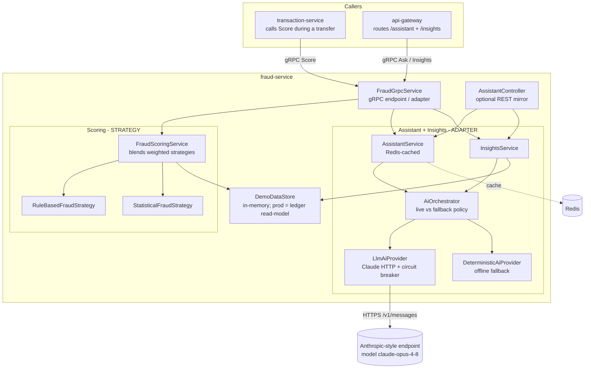
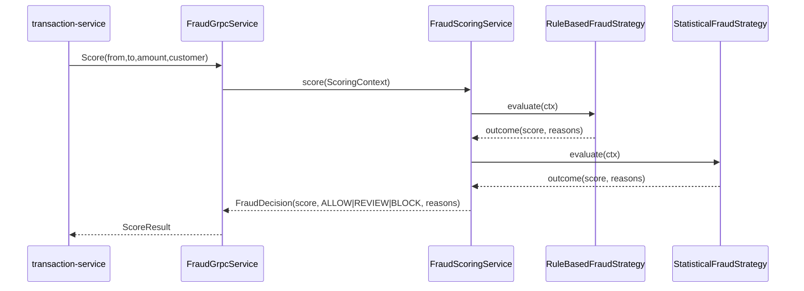
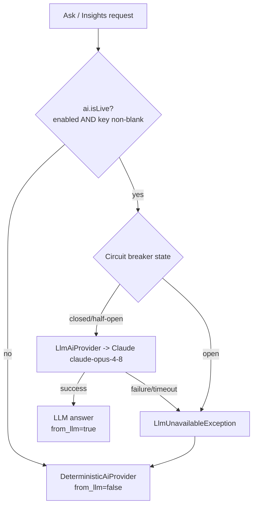

# fraud-service — design

The fraud-service is the platform's AI microservice. It exposes a single gRPC service,
`FraudService`, with three RPCs — `Score`, `Ask`, `Insights` — and an optional REST mirror.
It has **no relational database**; Redis is used only as a cache.

This document explains the three design patterns it is built around — **Strategy**,
**Adapter**, and **Circuit Breaker** — the graceful-degradation behaviour, the use of the
`claude-opus-4-8` model, and how the pieces fit together.

## Component overview

---

## 1. Strategy pattern — fraud scoring

Fraud detection is a family of interchangeable algorithms answering the same question:
*"how risky is this transfer?"*. Strategy lets us code each behind one interface and blend
them without the orchestrator knowing their internals.

- **`FraudStrategy`** — the strategy interface: `name()`, `weight()`, `evaluate(ctx)`.
- **`RuleBasedFraudStrategy`** (weight 0.6) — explicit policy heuristics:
  - **Amount thresholds** — large / very-large transfers add risk.
  - **Velocity** — too many recent transfers (account-takeover signal).
  - **New payee** — first-ever transfer to a destination, amplified if also large.
- **`StatisticalFraudStrategy`** (weight 0.4) — anomaly detection: builds a baseline
  (mean + sample standard deviation) from the customer's recent amounts and computes a
  **z-score** for the current amount; `|z| >= 3` saturates to maximum risk. Abstains when
  there is too little history.
- **`FraudScoringService`** — receives **all** strategy beans via constructor injection,
  computes a **weighted average** into a 0..1 score, and maps it to a decision:

  | blended score | decision |
  |---|---|
  | `>= 0.7` | **BLOCK** |
  | `>= 0.4` and `< 0.7` | **REVIEW** |
  | `< 0.4` | **ALLOW** |

Reasons from every strategy are prefixed with the strategy name and returned to the caller.
Adding a third algorithm (e.g. an ML model) is a new `@Component` and **zero** changes to the
orchestrator.

---

## 2. Adapter pattern — the AI provider

The assistant and the insights summary depend only on the **`AiProvider`** interface
(`answer`, `summarize`, `isLlm`). Two adapters implement it with very different mechanics:

- **`LlmAiProvider`** — adapts a remote **Anthropic-style HTTP API** (Claude) to the
  interface. It POSTs to `/v1/messages` with the model **`claude-opus-4-8`** (held as a
  constant `LlmAiProvider.MODEL`, also configurable via `securebank.ai.model`), passing a
  localized system prompt so the model replies in the requested language.
- **`DeterministicAiProvider`** — a fully offline adapter (keyword intent routing +
  localized templates for en/hi/mr). No network, no key, never fails.

Because both share the contract, callers swap between them with no knowledge of which is
active — and the choice can flip at runtime.

---

## 3. Circuit Breaker + graceful degradation

The LLM call is the only unreliable dependency, so it is wrapped with **Resilience4j**
`@CircuitBreaker` + `@Retry` (instance `llmProvider`). The single policy lives in
**`AiOrchestrator`**:

1. If `securebank.ai.isLive()` is false — feature disabled **or** the api-key is blank
   (the default) — skip the network entirely and use `DeterministicAiProvider`.
2. Otherwise call `LlmAiProvider`. If it throws `LlmUnavailableException` (circuit open,
   timeout, HTTP error, bad response), catch it and fall back to the deterministic provider.

Either way the caller gets an answer; `AskReply.from_llm` reflects which provider produced it.

**Breaker tuning** (see `application.yml`): 10-call sliding window, opens at a 50% failure
rate, stays open 30s, treats calls slower than 6s as failures. `@Retry` adds one retry on
transient blips. Tight HTTP timeouts (2s connect / 8s read) keep a waiting transfer from
hanging on `Score`/`Ask`.

---

## 4. Insights

`InsightsService` builds a category breakdown (sorted by amount, with percentages) from
`DemoDataStore`, then asks the `AiOrchestrator` to turn the deterministic facts into a short,
localized natural-language summary (LLM when live, template otherwise).

> **Production note:** there is no DB. `DemoDataStore` is a small in-memory stand-in for the
> **ledger read-model** owned by transaction-service. In production this service would query
> that read-model over gRPC; the demo store mirrors its shape so the swap is localized.

---

## 5. Caching, observability, runtime

- **Redis** (Spring Cache) caches assistant answers keyed by `locale|question` (10-min TTL),
  preserving the `from_llm` flag on hits and shielding the LLM from duplicate load.
- **Virtual threads** (`spring.threads.virtual.enabled=true`) let blocking work (LLM HTTP,
  Redis) scale on Java 21 without a large thread pool.
- **Actuator + Micrometer/Prometheus**: `/actuator/health` (with liveness/readiness probe
  groups + circuit-breaker health), `/actuator/prometheus`, `/actuator/circuitbreakers`.

## Configuration reference

| Property | Default | Meaning |
|---|---|---|
| `securebank.ai.enabled` | `true` | Master switch for LLM usage |
| `securebank.ai.base-url` | `https://api.anthropic.com` | Anthropic-style endpoint |
| `securebank.ai.api-key` | *(blank)* | API key; blank ⇒ deterministic mode |
| `securebank.ai.model` | `claude-opus-4-8` | Model id |
